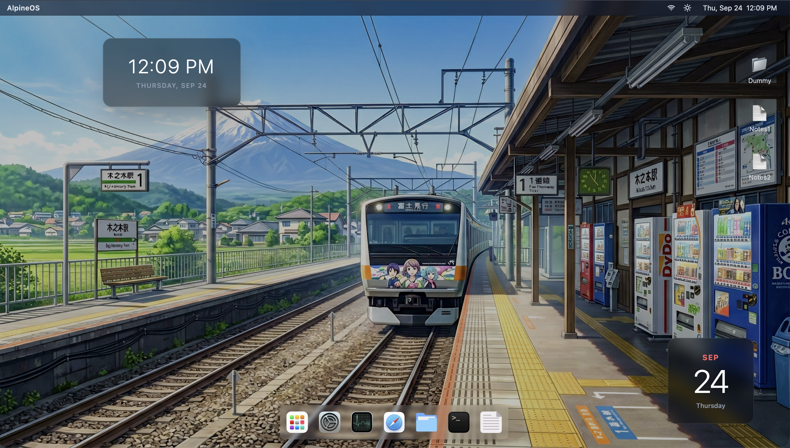
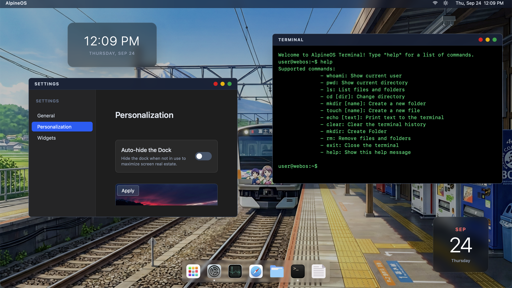
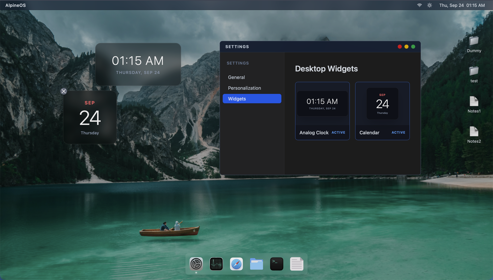
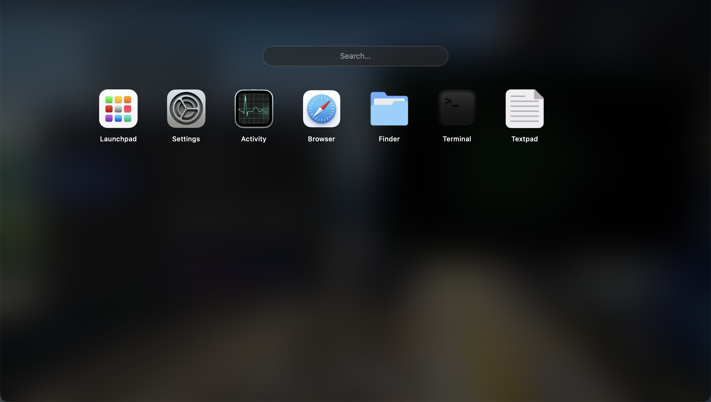

# AlpineOS

> A functional, persistent, browser-based operating system, not just a CSS UI mockup AlpineOS is a web-based desktop environment powered by a custom Redux "kernel." It features real background process management, a persistent virtual file system, and an advanced window management engine. 


**See live demo** [https://alpine-os-eight.vercel.app](https://alpine-os-eight.vercel.app)

**OR Wanna run locally** checkout bottom of the readme

**Contact Me** ashishrajsingh75@gmail.com

---

## I built AlpineOS
- live Activity Manager that tracks active PIDs and simulated CPU/Memory telemetry.
- It includes a persistent Virtual File System
- An draggable Window Manager
- Terminal engine that interacts with the File System
- Persistency , File and folders are persistent and so it the state of the OS, you leave and come back just find that it has retained the state.
- process and window management like a real os
- sending proper app closing signals like "SIGTERM" to the process when closing the app, instead of just closing the window and leaving the process running in background

# The Challenge?
The architecture and state management were incredibly complex. 
- synchronizing the UI with the actual process management in the "kernel"
- Persistence, making the whole website persistence.
- Creating an Task manager was fun and exciting, it felt like a real low level OS feature
- In WebOs the main challenge was reading how actual os works, i even read some scheduling algorithms like SJF, FCFC but yeah not going to implement them anytime soon

# Excitement??? hell yeah
- my whole time I have been building, high-level websites and backend. I never tried a low level project, although this is not Low Level but it forced me to explore the architecture and concepts of hoow operating system works at Low level, how terminal connect with the file system.
- who doesn't get excited by low level ??
- Being able to selec multiple files and folder, not draggable yet, but soon will be


# What can i do?
- When you boot it up, don't just click the icons  and look and design and colors, stress test the ARCHITECTURE!
- Open the Terminal , use ```cd``` to change directory and  try standard commands like mkdir, touch, ls, and interact with the file system
- Create Text files and folders
- use Terminal to create file ```touch``` and folders ```mkdir```, change directory ```cd```, delete with ```rmdir```, more commands ```ls```, ```pwd```, ```whoami```, ```help```
- Use Activity App to see all the currenlty running processes
- you can force quit a applcation
- Can open personalization setting by right click on the desktop, change wallpapers, more customization will be added soon 
- Browser - allows to visit wesite that do not block iframe requests like wikipedia
- Finder - File manager can do all the basic File management taks - CRUD, can selete files and folders just like real OS
- TextPad - allows creation and updation of text files
- Open the Activity Manager side-by-side with other apps to watch the active processes update and check the live  charts (dummy)
- Right-click the desktop to open Personalization and change the wallpaper.
- when you close an app it send the signal to process insteed of directlly clsing it, it helps when you have some unsaved text content in your textpad app and you try to close it, the process can intercept the closing and warn you about the unsved changes before closing
- you can now add widgets on the desktop from the settings app
- can change brightness of the display
- can see date and time from the menu bar

**Most importantly:** Open a few windows, move them around the screen, and then hard refresh your browser or maybe just restart and  Watch the persistence engine drop you right back where you left off.


---

## ✨ What did i create?

* **Decoupled Window & Process Management:** Inspired by real operating systems, AlpineOS separates background processes from visual UI windows. Closing an app destroys both the UI frame and the underlying process ID via a custom Redux slice, preventing memory leaks and ghost processes.

* **Persistent Virtual File System:** Powered by `localForage` and `redux-persist`. You can create, edit, and delete files/folders, and the entire file tree survives browser refreshes and tab closures. 


* **Authentic Boot Sequence:** Simulates a real BIOS boot with dynamic delays, system checks, state hydration, and persistence-aware sleep/shutdown states.


* **Native Terminal Engine:** A robust CLI that interacts directly with the VFS. Supports commands like `cd`, `ls`, `mkdir`, `rm`, `touch`, `echo`, `help`, and more.


* **Activity Manager:** A real-time system monitor detailing all active processes (PIDs), CPU/Memory telemetry visuals, and the ability to force-kill stubborn processes.

* **Advanced Window Manager:** Fully draggable, resizable windows with a dynamic z-index arbiter to handle window focus seamlessly.

* **Dynamic Menu Bar & Dock:** Linux-inspired navigation. The top menu bar contextually adapts to the currently focused application, while the bottom dock manages quick-access and active apps.

* **Context Menus:** Fully custom right-click menus that adapt based on the target (e.g., desktop, files, dock).

## 🛠️ Tech Stack

* **Frontend Framework:** React 18
* **State Management:** Redux Toolkit
* **State Persistence:** Redux Persist + localForage (IndexedDB)
* **Styling:** Tailwind CSS
* **Telemetry Visuals:** Recharts
* **Build Tool:** Vite
* **Animation**: Framer-motion

## WebOS2 Updates
- My primary goal with this project was to make it as close to real OS concepts as possible
- in this update i have tried to do that, and also build some more features to make it feel like an os


## Process & Window Management
* Separated the window and process management jsut like real OS, like window UI is provided by the Os but whats running inside the window is controlled by another applicaiton software
* now the process controls the closign of the app, instead of winodw which was the case in last version

# Maximize & Minimize
* Maximize & minimize window functionality was added
* i created smart minimize feature , the dock now shows indicator if an app is open but minimised and when clicked it detected the condition and either open the app from background or relaunches depeding upon the state
* maximize also had a bugs, that it was going under the menu bar and dock even in full scren which is fixed now

## Settings App
* Earlier there was a personalize app, which just changes the wallpapers
* this is now merged as a tab in the new brand new settings app, which houses overall settings of the OS
* like wallpaper, general, widgets
* 

## Widgets
* Widgets can now be added on the desktop and are draggable to any position on the desktop


## Dock
- dock is nore improved it has detection for apps state like open, maximized or minimized
- it also has a feature of auto hide similar to macos dock, and shows up automatically on hovering the lower areas screen

## Launch pad


## 🚀 Run it Locally

   ```bash
   git clone https://github.com/ashish757/alpineos.git
   cd alpineos
   npm install
   npm run dev
   ```
you are all set on http://localhost:5173


# Acknowledgement
- use a subreddit r/wallpaper for most of the wallpapers featured in this project

# AI
- used AI to learn about real OS architectures, like how to solve the window positining? got to know how apple uses bounded cascade for positioning windows, 
- used AI to for quickly genrating eneric and reusable UI components, such as.
- took help from AI, and my collage friend to fix bugs, like closing window was not quiting the process itslef, window positioning problem and its algorithm
- used AI to create the ui of the widgets, just some tailwind snippets i used